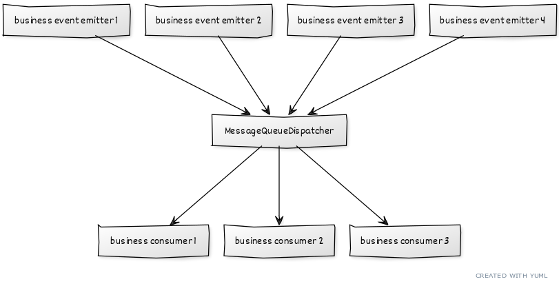

# rabbitmq-splitter

Route a RabbitMQ message from one queue to many — with static or hot-reloaded YAML mappings.



## Why

When a single incoming event needs to be processed by multiple downstream services, `rabbitmq-splitter` acts as a fan-out hub: it consumes from a source queue and republishes the message to every destination queue defined in the mapping.

```
incomingPurchase  ──►  billing
                  ──►  supply
                  ──►  shipping
```

Mappings can be set programmatically or loaded from a YAML file that is automatically reloaded on every save.

### Isn't RMQ enough ?

When splitting the business logic into multiple services, you have to look for a complete isolation of services : your incoming purchase events does *not* know who will consume its events and does *not* know how many services have to consume it. At the same time, you must ensure than *all* the needed services will wake up and process their job.

If you only throw the messages into RMQ and pray for every service to work perfectly, it is not sufficient. You must ensure every part of the job is done.

#### Resilience
What happens if a consumer if not listening to the message queue ? The message will be processed by the other services but a part of the job will me lost.

RMQ does not know your own business logic, the idea in the repository is to provide a declarative way to define your *own* logic. 

RMQ cares about the event delivery, you care about the business responsibily splitting.

---

## Prerequisites

- Node.js 18+
- A running RabbitMQ instance

---

## Installation

```bash
npm install rabbitmq-splitter
```

Or clone and run the examples locally:

```bash
git clone https://github.com/khayyam90/rabbitmq-splitter
cd rabbitmq-splitter
npm install
```

---

## Usage

### Programmatic mapping

```ts
import { RmqConnection } from 'rabbitmq-splitter'

const rmq = new RmqConnection('guest:guest@localhost:5672');

rmq.setMapping({
  incomingPurchase: ['billing', 'supply', 'shipping'],
  newUser:          ['welcomeMessage'],
  deleteUser:       ['deletionMessage', 'legal'],
});
```

### File-based mapping (with hot-reload)

Define your routing rules in a YAML file:

```yaml
# logic-mapping.yaml
incomingPurchase:
  - billing
  - supply
  - shipping

newUser:
  - welcomeMessage

deleteUser:
  - deletionMessage
  - legal
```

Then point the splitter at it:

```ts
import { RmqConnection } from 'rabbitmq-splitter'

const rmq = new RmqConnection('guest:guest@localhost:5672');

rmq.listenFileMapping('logic-mapping.yaml');
// Mapping is re-applied automatically whenever the file changes
```

### Consuming messages

```ts
type OrderEvent = { orderId: number; amount: number }

rmq.consume<OrderEvent>('billing', msg => {
  console.log('billing received', msg);
});
```

### Sending messages

```ts
rmq.sendToQueue('incomingPurchase', { orderId: 42, customer: 'Alice' });
```

### Cleanup

```ts
rmq.close();
```

---

## API

### `new RmqConnection(host: string)`

| Parameter | Description |
|-----------|-------------|
| `host` | Connection string in the form `user:pass@host:port` |

### `connect(): Promise<void>`

Opens the connection and creates a publisher. Called automatically by `consume`.

### `consume<T>(queue, callback): Promise<void>`

Subscribe to a queue. Messages are JSON-decoded before being passed to the callback.

### `sendToQueue<T>(queue, message): Promise<void>`

Publish a JSON-serialized message to a queue.

### `setMapping(mapping): void`

| Parameter | Description |
|-----------|-------------|
| `mapping` | `Record<string, string[]>` — maps each source queue to an array of destination queues |

Closes any previously registered mapping consumers before applying the new ones.

### `listenFileMapping(fileName): void`

Load routing rules from a YAML file and re-apply them whenever the file changes on disk.

### `close(): void`

Close the publisher and all consumers.

---

## Running the examples

```bash
# YAML-based routing (with hot-reload)
npm run example

# Hardcoded routing
npx ts-node -r tsconfig-paths/register examples/hardcoded-routing.ts
```

---

## Building

```bash
npm run build   # compiles to dist/
```

---

## License

[ISC](LICENSE)
